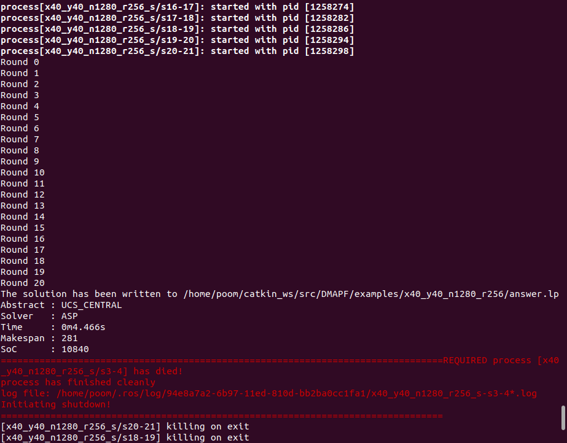
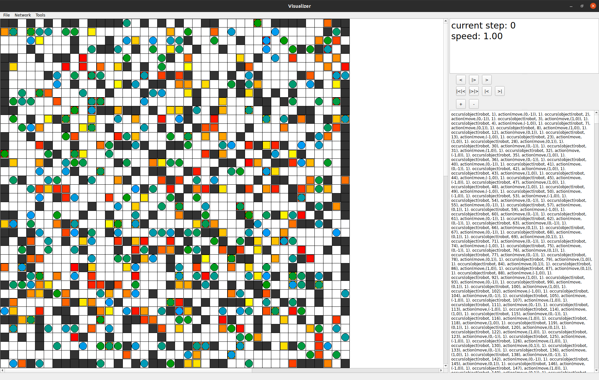
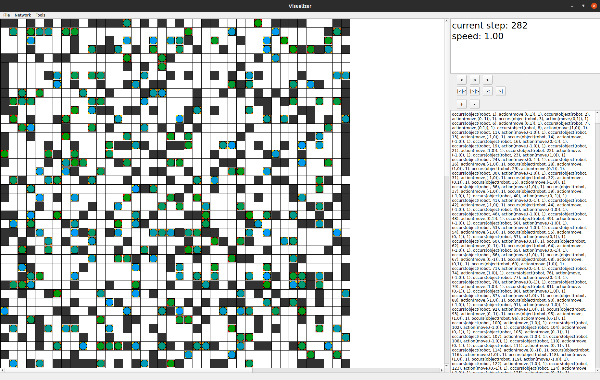

# Installation
1. Install conda or [miniconda](https://docs.conda.io/en/latest/miniconda.html).
2. Install clingo by `conda install -c potassco clingo`.
3. Install asprilo visualizer by `conda install -c potassco asprilo-visualizer`.
4. Install ROS [Noetic](http://wiki.ros.org/noetic/Installation/Ubuntu) and create a ROS [workspace](http://wiki.ros.org/ROS/Tutorials/InstallingandConfiguringROSEnvironment). It may be installed via Conda (See [https://github.com/RoboStack/ros-noetic](https://github.com/RoboStack/ros-noetic)).
5. Clone this Git repo into \~/catkin_ws/src by `git clone --recurse-submodules https://github.com/ppianpak/DMAPF.git`.
   - If you forgot to use `--recurse-submodules` in `git clone`, you can still initialize the submodules by `git submodule update --init` in the project directory.
6. Compile the project by `catkin_make -DCMAKE_BUILD_TYPE=Release` in \~/catkin directory.

By default, DMAPF uses Answer Set Programming (ASP) as its underlying solver. This can be change by compiling with
- `catkin_make -DSOLVER=CBSH2_RTC` to use CBSH2-RTC ([https://github.com/ppianpak/CBSH2-RTC](https://github.com/ppianpak/CBSH2-RTC))
- `catkin_make -DSOLVER=EECBS` to use EECBS ([https://github.com/ppianpak/EECBS](https://github.com/ppianpak/EECBS))
- `catkin_make -DSOLVER=PBS` to use PBS ([https://github.com/ppianpak/PBS](https://github.com/ppianpak/PBS))
- `catkin_make -DSOLVER=ASP` to use ASP

# Possible Compilation Errors
- ModuleNotFoundError: No module named 'em'
  - Solution
  
  ```
  pip install empy
  ```

- ModuleNotFoundError: No module named 'catkin_pkg'
  - Solution
  
  ```
  pip install catkin_pkg
  ```

- /usr/bin/ld: /lib/x86_64-linux-gnu/libapr-1.so.0: undefined reference to `uuid_generate@UUID_1.0'
  - Solution ([link](https://github.com/uzh-rpg/rpg_esim/issues/7)):
  
  ```
  ls ~/miniconda3/lib/libuuid*
  mkdir ~/miniconda3/libuuid
  mv ~/miniconda3/lib/libuuid* ~/miniconda3/libuuid
  ```
## Notes
- All generated problems will be in `dmapf/examples` directory by default.
- All problems should be put in `dmapf/examples` directory for the scripts to run properly.
- There are generally 3 steps in using DMAPF:

1. Generate a problem instance. This can be done using `gendiv` or obtained from the ([MAPF benchmark](https://movingai.com/benchmarks/mapf/index.html)) and convert the map file into lp file with `map2lp`. For example,
```
rosrun dmapf map2lp -m $HOME/catkin_ws/src/DMAPF/examples/random-64-64-20/random-64-64-20.map -s $HOME/catkin_ws/src/DMAPF/examples/random-64-64-20/scen-random/random-64-64-20-random-1.scen -r 1000
```

2. Divide a problem instance. For example,
```
rosrun dmapf gendiv -d -f $HOME/catkin_ws/src/DMAPF/examples/random-64-64-20/r1000/random-64-64-20_n3270_r1000.lp --bk-means -s 20 -k 54 --seed 2
```

3. Solve sub-problems after the division in parallel. For example,
```
roslaunch dmapf random-64-64-20_n3270_r1000.launch
```

# Problem Generator and Divider
```
Usage: rosrun dmapf gendiv [options]
Options:
  --help, -h      Print help and exit
  --file, -f      Set a full path to generate a problem (1)
                  or divide a problem (2)
(1)-------------------------------------------------------------
  --gen, -g       Only generate a problem instance 
  --col, -x       Set the number of columns
  --row, -y       Set the number of rows
  --nodes, -n     Set the number of nodes
  --robots, -r    Set the number of robots
  --seed          Set the seed for randomization
  --random        Totally random (some goals may be unreachable)
(2)-------------------------------------------------------------
  --div, -d       Only divide a problem instance
  --solvers, -s   Set the number of solvers
  --clusters, -k  Set the number of clusters
    --bk-means    Partition the problem using balanced k-means (default)
    --bk-means-sq Partition the problem using balanced k-means with square matrix
    --k-medoids   Partition the problem using k-means
  --dcol, -dx     Set the number of divided columns
  --drow, -dy     Set the number of divided row
    --naive       Partition the problem naively

Full mode requires -x, -y
Generate-only mode (-g) requires -x, -y
Divide-only mode (-d) requires -f
```

# Example
### Generate a problem with 40x40 map, 320 obstacles, and 256 robots, then (naively) divide it into 8x8 subproblems
`rosrun dmapf gendiv -x 40 -y 40 -n 1280 -r 256 --naive -s 20 -dx 8 -dy 8 --seed 2`

### Solve the problem
`roslaunch dmapf x40_y40_n1280_r256-seed2.launch`



### Visualize the answer
`viz -t ~/catkin_ws/src/DMAPF/examples/x40_y40_n1280_r256/answer.lp`




